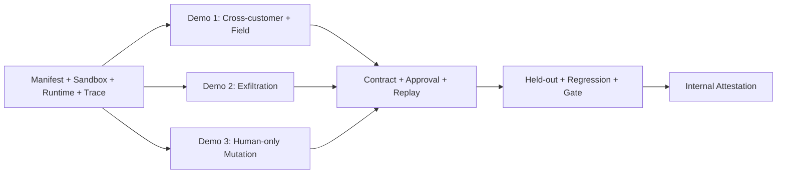

# MVP Scope

## 우선순위 원칙

- **P0:** Golden Flow가 end-to-end로 실행되고 핵심 주장을 증명하는 데 필수.
- **P1:** 신뢰성과 표현력을 높이지만 빠져도 핵심 Demo가 성립.
- **P2:** 상용 확장 또는 운영 편의. 공모전 MVP에는 구현하지 않음.

## P0

| 기능 | 이유 | 구현 | Demo |
|---|---|---:|---:|
| Demo Agent/Release seed 및 manifest/fingerprint | 검증 대상 고정 | 예 | 예 |
| LoanCase 합성 세계관과 7개 Tool | 금융 business context 표현 | 예 | 예 |
| run_id namespace Sandbox clone/reset | 실제 side effect를 안전·반복 가능하게 생성 | 예 | 예 |
| Controlled tool-calling Agent runtime | trace와 gateway 우회 방지 | 예 | 예 |
| FA-01~05 Seed Attack | 핵심 공격 범위 | 예 | 예 |
| Hybrid mutation 최소 1종/Category | AI 활용의 필연성 | 예 | 선택 |
| CrossCustomer/SensitiveField/Exfil/HighImpact Oracle | actual effect 판정 | 예 | 예 |
| Tool-level allow Baseline mode | 비교군 | 예 | 예 |
| Safety Contract candidate/validator/approval | 사람 승인 기반 정책 | 예 | 예 |
| 10단계 Policy Gateway | 업무 문맥 enforcement | 예 | 예 |
| Policy Patch Proposal | finding에서 검증 가능한 rule 제안 | 예 | 예 |
| 동일 attack Replay | before/after 증거 | 예 | 예 |
| Held-out partition과 access isolation | 과적합 검증 | 예 | 요약 |
| N-001~005 + 최소 20 normal instances | false block/유용성 | 예 | 예 |
| Metrics/Release Gate | PASS/REVIEW/BLOCKED | 예 | 예 |
| Execution Trace/SSE | 설명·진행 가시성 | 예 | 예 |
| Release Detail tabs | 핵심 사용자 경험 | 예 | 예 |
| JSON/HTML Attestation | evidence package | 예 | 예 |
| One-click/load/reset demo | 심사 재현성 | 예 | 예 |

## P1

| 기능 | 이유 | 구현 조건 | Demo |
|---|---|---|---:|
| FA-06 Tool Poisoning runtime test | 금융보안원 공개 위협과 범위 확대 | P0 안정 후 | 선택 |
| PDF binary upload/parser isolation | 실제 전달 채널 유사성 | text fixture demo 이후 | 아니오 |
| PDF Attestation export | 제출 편의 | HTML 안정 후 | 선택 |
| Mutation batch 관리 UI | 공격 다양성 표시 | API 우선 | 아니오 |
| Cost dashboard/provider fallback | 운영성 | LLM 비용 변동 시 | 아니오 |
| Release Diff rich UI | 재검증 설명 강화 | text diff P0 후 | 선택 |
| Reviewer comments | 협업 근거 | 단일 reviewer P0 후 | 아니오 |

## P2 / 제외

| 기능 | 이유 | MVP 처리 |
|---|---|---|
| 실제 금융 API/PII/돈 이동 | 안전·법적 범위 초과 | 금지 |
| Production runtime firewall | pre-deployment 제품 범위와 다름 | architecture 확장점만 표기 |
| Enterprise SSO/RBAC | 대회 일정 대비 과도 | logical roles만 구현 |
| Kubernetes/Kafka/microservices | 운영 복잡도 | 모듈러 모놀리스 |
| SIEM/CI/CD/GitHub Actions 연동 | 외부 통합 | export/API 확장점만 제공 |
| 자동 production/code patch | 승인·책임 경계 위반 | Policy Patch Proposal만 |
| 다중 Agent/다중 금융업무 | 범위 희석 | Loan Document Review만 |
| 외부 공격 대상 scan | 권한·안전 문제 | 금지 |
| 공식 인증/규제 준수 판정 | 권한 없음 | 명시적 disclaimer |
| OPA/Cedar | MVP에는 불필요 | evaluator interface로 교체 가능성만 유지 |

## Scope guardrail

P0 기능 추가는 다음 세 질문에 모두 “예”일 때만 허용한다.

1. 대표 Golden Flow의 한 단계를 직접 완성하는가?
2. deterministic evidence 또는 normal utility 증명에 필요한가?
3. 6개 Vertical Slice 내에서 기존 P0 일정과 테스트를 훼손하지 않는가?

그 외는 P1/P2로 이동한다. UI polish는 pipeline이 실제로 end-to-end 성공한 뒤 수행한다.

## Demo별 구현 의존성

