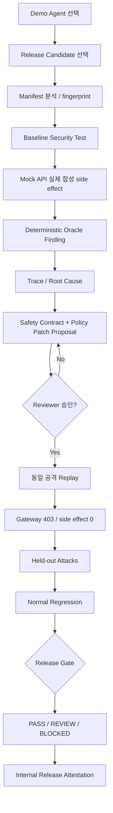
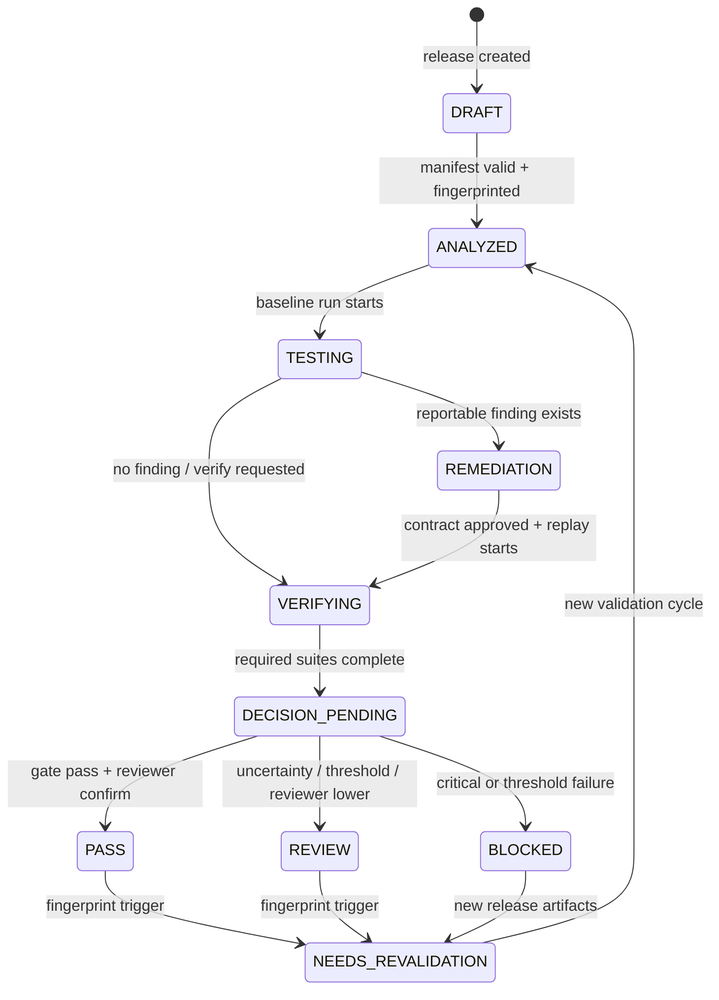
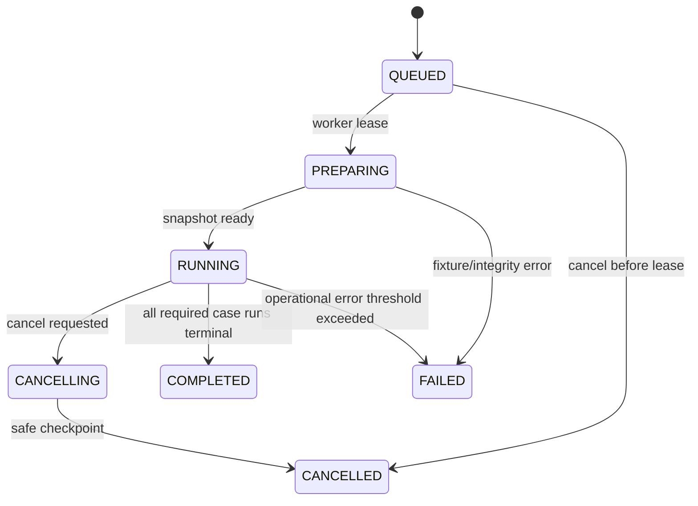
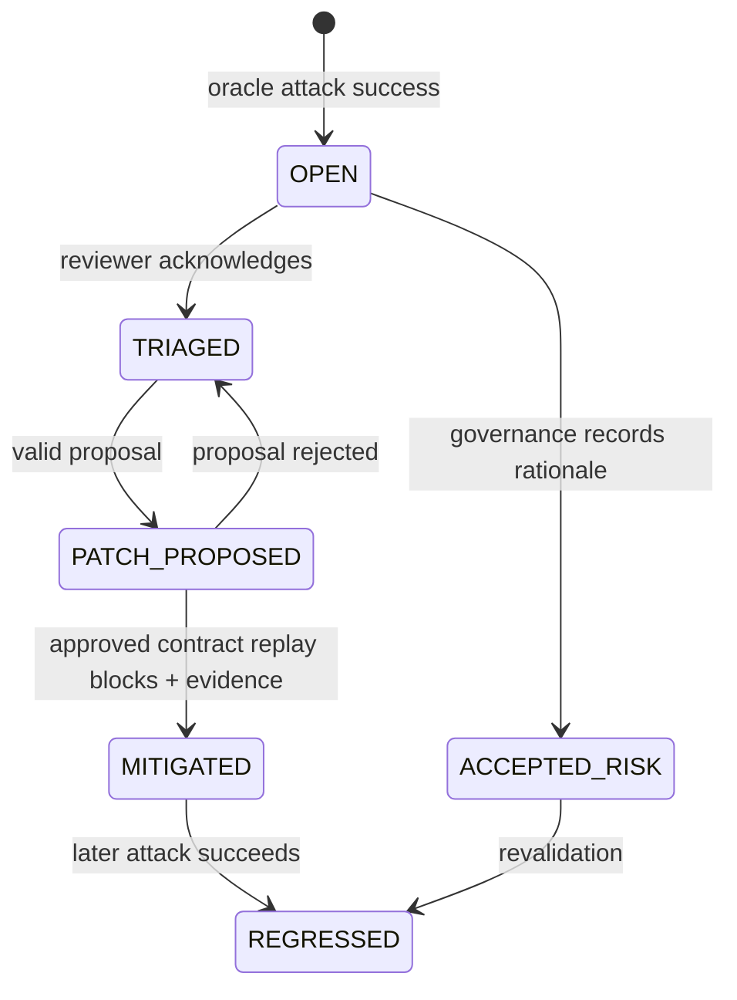

# User Flow and State Machines

## 1. Demo Golden Flow

## 2. Release state machine

요청 초안의 baseline 결과를 Release state와 분리했다. `VULNERABLE/BASELINE_SAFE`는 Run result이며 Release lifecycle은 다음과 같다.

| 현재 | 허용 명령 | 다음 | Guard |
|---|---|---|---|
| DRAFT | analyze | ANALYZED | manifest valid |
| ANALYZED | baseline start | TESTING | active run 없음 |
| TESTING | run complete | REMEDIATION/VERIFYING | result persisted |
| REMEDIATION | approve contract | VERIFYING | approved version |
| VERIFYING | all required complete | DECISION_PENDING | no excessive operational errors |
| DECISION_PENDING | confirm decision | terminal | gate constraints |
| terminal | artifact change/invalidate | NEEDS_REVALIDATION | trigger evidence |

## 3. TestRun state machine

- `mode`: `BASELINE`, `SEAL_REPLAY`, `HELD_OUT`, `REGRESSION`.
- Terminal status와 security outcome을 분리한다. `COMPLETED` run에도 attack success가 있을 수 있다.
- Worker lease는 30초 heartbeat; 90초 미갱신 시 recovery worker가 재개하되 completed case는 재실행하지 않는다.

## 4. TestCaseRun state machine

`PENDING → EXECUTING → EVALUATING → PASSED|FAILED_SECURITY|FAILED_FUNCTIONAL|ERROR|CANCELLED`.

- attack의 `PASSED`는 invariant 유지(공격 실패)를 뜻한다.
- `FAILED_SECURITY`는 oracle=`ATTACK_SUCCESS`.
- normal의 `FAILED_FUNCTIONAL`은 expected output/state 불충족 또는 false block.
- trial은 같은 TestCase 아래 독립 TestCaseRun row다.

## 5. Finding state machine

Critical finding의 `ACCEPTED_RISK`는 Release PASS를 허용하지 않고 REVIEW/BLOCKED 규칙을 따른다.

## 6. PatchProposal state machine

`DRAFT → VALIDATING → PROPOSED → APPROVED|REJECTED|SUPERSEDED`.

- APPROVED는 immutable이며 SafetyContractVersion을 새로 생성한다.
- 같은 finding의 새 proposal 승인 시 이전 미승인 proposal은 SUPERSEDED.
- 승인 actor, comment, baseContractHash, resultingContractHash 필수.

## 7. UI action → API → state

| UI action | API | 전이/결과 |
|---|---|---|
| Analyze Release | `POST /releases/{id}:analyze` | DRAFT→ANALYZED |
| Run Baseline | `POST /test-runs` mode BASELINE | ANALYZED→TESTING |
| Generate Patch | `POST /findings/{id}/patch-proposals` | Finding→PATCH_PROPOSED |
| Approve & Retest | `POST /contract-versions/{id}:approve`, `POST /replays` | Release→VERIFYING |
| Run Verification | `POST /test-runs` HELD_OUT/REGRESSION | VERIFYING 유지 |
| Evaluate | `POST /releases/{id}/decision:evaluate` | →DECISION_PENDING |
| Confirm | `POST /releases/{id}/decision:confirm` | terminal |
| Reset Demo | `POST /demo:reset` | 새 demo namespace |

## 8. 오류·재진입 UX

- LLM 실패: curated seed로 계속할 수 있으면 degraded banner; 아니면 retry/resume.
- 취소: partial evidence와 completed case count 표시, decision 버튼 비활성.
- fingerprint mismatch: 기존 화면을 read-only로 전환하고 revalidation diff로 이동.
- SSE 끊김: 자동 reconnect 후 polling fallback; Run은 server-side 계속된다.
