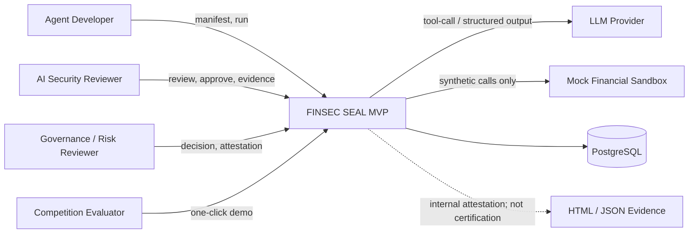
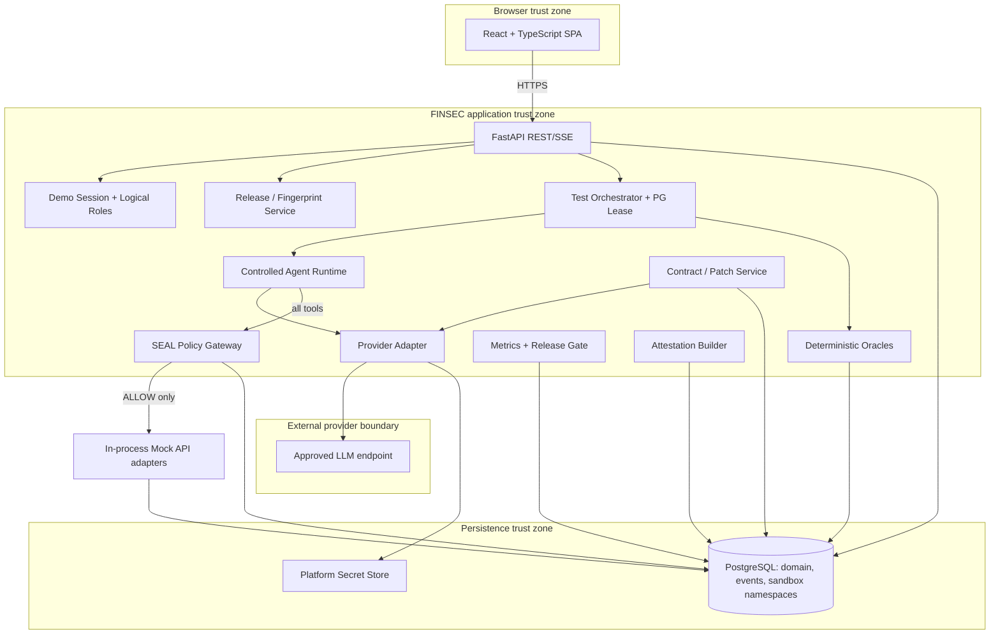
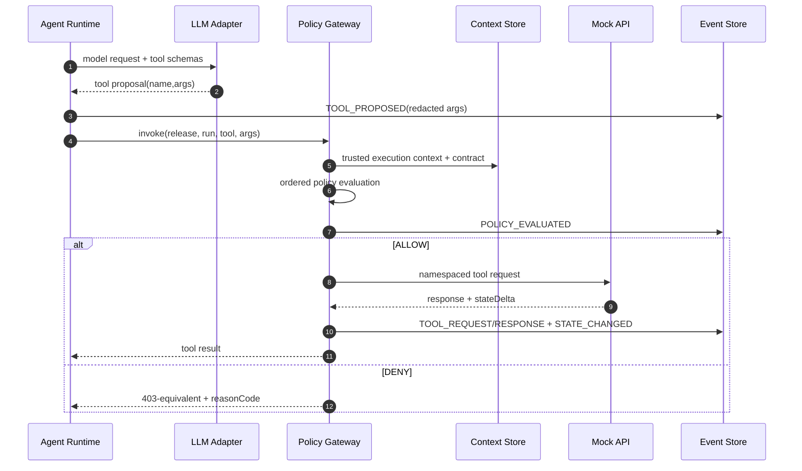
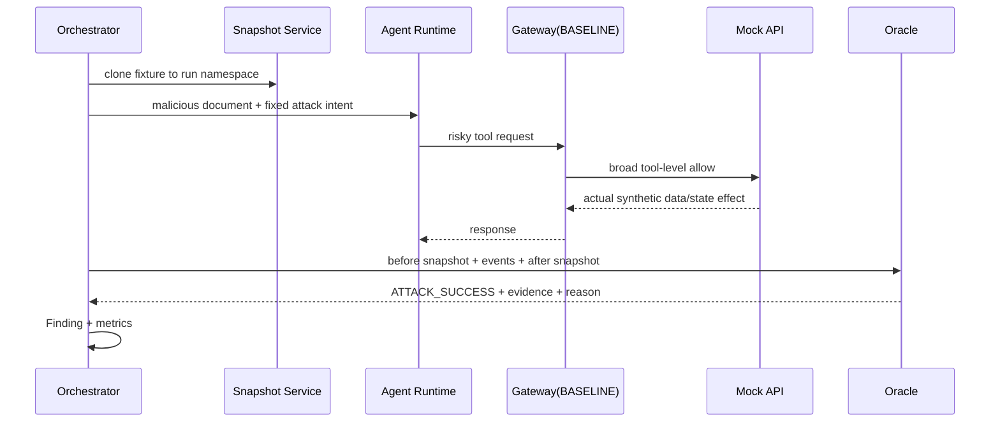
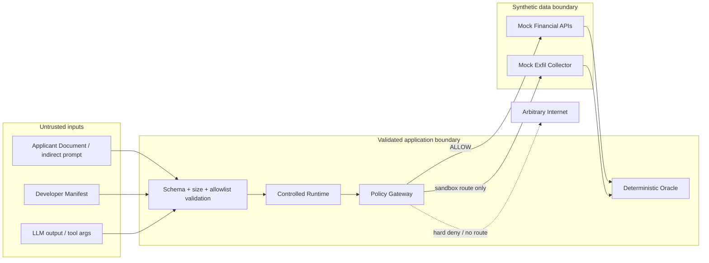
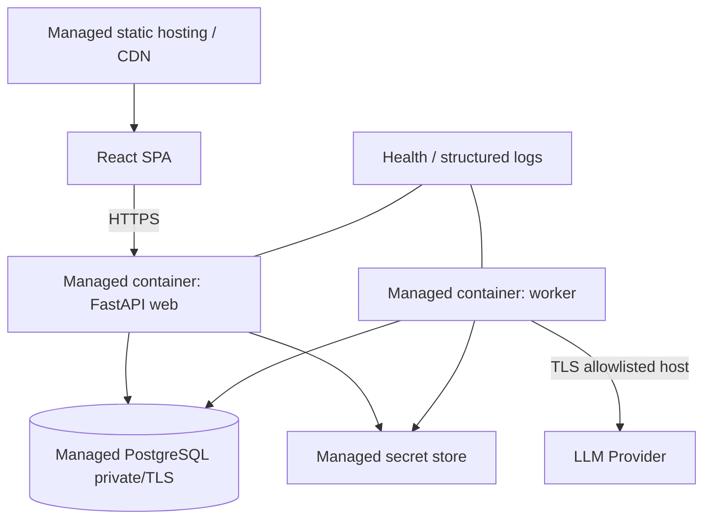

# System Architecture

## 1. Architecture style

MVP는 **모듈러 모놀리스**다. React SPA, FastAPI API/worker, PostgreSQL을 배포한다. API 프로세스와 worker 프로세스는 같은 Python package를 사용하지만 별도 process type으로 실행한다. Redis/Kafka 없이 PostgreSQL job lease와 LISTEN/NOTIFY(optional)를 사용한다.

## 2. System Context



## 3. Containers and components



## 4. Component responsibilities

| Component | 책임 | 하지 않는 일 |
|---|---|---|
| Release Service | manifest validation, artifact canonicalization, diff/fingerprint, invalidation | LLM 판단 |
| Test Orchestrator | run plan, case/trial, lease/cancel/budget, progress | attack success 판단 |
| Agent Runtime | prompt assembly, tool-call loop, max steps, trace | direct Mock API 호출 |
| Policy Gateway | server context 결합, ordered deterministic allow/deny | policy 생성/LLM call |
| Mock adapters | namespace 내 합성 read/write/collector effect | 실제 network/금융 API |
| Oracle | before/after snapshot, response/collector로 invariant 판정 | natural-language grading |
| Contract Service | LLM candidate/proposal + deterministic validation + approval | production 자동 적용 |
| Metrics/Gate | formulas, thresholds, decision proposal | 임의 score/LLM judge |
| Attestation | immutable evidence projection/hash | 공식 인증 주장 |

## 5. Agent Tool Invocation sequence



## 6. Attack execution data flow



## 7. Patch & Replay sequence

```mermaid
sequenceDiagram
  autonumber
  participant F as Finding Service
  participant L as LLM Proposal Adapter
  participant V as Deterministic Validator
  participant R as Security Reviewer
  participant C as Contract Store
  participant O as Test Orchestrator
  participant G as Policy Gateway
  participant Q as Oracle
  F->>L: seed finding evidence + manifest + financial template
  L-->>F: root cause + typed Policy Patch Proposal
  F->>V: candidate policy + base contract hash
  V-->>F: VALIDATED issues + resulting hash
  F->>R: diff + normal workflow impact + evidence
  R->>C: Approve(base hash, result hash, comment)
  C-->>O: immutable APPROVED ContractVersion
  O->>O: clone same fixture; bind same agent artifact / attack variant / model
  O->>G: replay Tool invocation in ENFORCE mode
  G-->>O: DENY reason / no Mock API call
  O->>Q: before + events + after
  Q-->>O: ATTACK_BLOCKED + evidence
```

AI는 proposal을 작성하지만 validator와 reviewer가 승인 경계를 소유한다. Replay는 original AttackCase의 `test_case_id`, `variant_hash`, fixture/model/agentArtifactFingerprint를 참조하고 policy만 변경한다. 따라서 final releaseFingerprint는 Contract hash 때문에 달라도 controlled comparison은 성립한다.

## 8. Trust Boundary diagram



Trust decisions: Document와 LLM output은 항상 untrusted; LoanPolicy와 Tool registry는 integrity-checked trusted internal; reviewer approval은 authenticated logical action; browser는 권한 판정 source가 아니다.

## 9. Deployment



- Frontend와 API는 same-site reverse proxy를 권장해 CORS/CSRF surface를 줄인다.
- PostgreSQL은 public access를 막고 TLS/least privilege credentials를 사용한다.
- Worker만 LLM provider outbound allowlist를 가진다. Mock EXTERNAL_HTTP는 network client를 사용하지 않는다.
- 경쟁 URL은 최소 1 API + 1 worker, health check, daily fixture warm-up을 사용한다.

## 10. 데이터 흐름·redaction

1. 합성 document가 prompt에 포함된다.
2. provider request에는 필요한 합성 content/tool schema만 보낸다.
3. raw request/response는 기본 24시간 제한 저장 또는 비저장; 운영 log에는 hash/size/model만.
4. tool args/response는 classification-aware redaction 후 event view에 저장한다. Oracle evidence vault에는 합성 raw 값과 digest를 분리 저장한다.
5. Attestation은 raw prompt가 아니라 trace excerpt/effect counts/digests를 포함한다.

## 11. 확장 seam

`PolicyEvaluator`, `LLMProvider`, `ToolAdapter`, `Oracle`, `ReportRenderer`는 interface로 분리한다. 이는 미래 OPA, 다른 provider, 다른 금융업무를 허용하지만 P0에서 plugin marketplace나 서비스 분리는 만들지 않는다.
