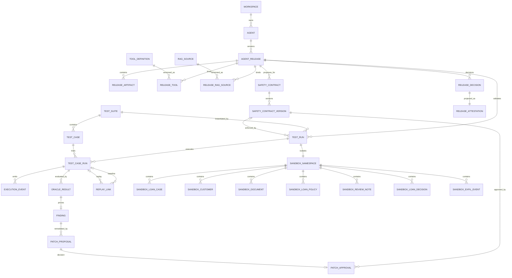

# ERD and Data Dictionary

## 1. 물리 모델 원칙

- PostgreSQL 16 기준. PK는 UUIDv7 `uuid`, 시간은 `timestamptz`, enum은 migration 부담을 줄이기 위해 validated `varchar` + CHECK.
- 조회·관계·무결성·metric denominator가 필요한 값은 정규화한다. provider payload, policy/manifest snapshot, event body, evidence는 versioned JSONB를 사용한다.
- 모든 tenant-facing table은 P0에서도 `workspace_id`를 가진다. Demo는 단일 workspace지만 쿼리 누락을 테스트한다.
- 보안/감사 증거는 hard delete하지 않는다. 사용자 데이터가 합성이므로 retention 후 partition drop은 운영 정책으로 수행한다.

## 2. Logical ERD

## 3. Core dictionary

### workspace

`id PK`, `name`, `mode(DEMO)`, `created_at`. Root lifecycle owner. P0 삭제 금지.

### agent

`id PK`, `workspace_id FK`, `agent_key`, `name`, `purpose_summary`, `status`, timestamps. UNIQUE `(workspace_id, agent_key)`. Agent 삭제는 `ARCHIVED`; Release cascade 금지.

### agent_release

`id PK`, `agent_id FK`, `version`, `business_purpose`, `manifest_schema_version`, `manifest_json jsonb`, `agent_artifact_fingerprint_sha256`, `release_fingerprint_sha256`, `lifecycle_state`, `effective_status`, `revalidation_reason_json`, timestamps. Final release fingerprint는 approved contract hash를 포함한다. UNIQUE `(agent_id, version)` 및 `(agent_id, release_fingerprint_sha256)`; 승인 전 null-contract fingerprint transition은 history/audit로 보존한다. Agent와 RESTRICT.

### release_artifact

`id PK`, `release_id FK`, `artifact_type(MODEL_CONFIG|SYSTEM_PROMPT|TOOL_SCHEMA|TOOL_DESCRIPTION|RAG_CONFIG|BUSINESS_WORKFLOW|RUNTIME_CONTEXT|SAFETY_CONTRACT)`, `name`, `content_json jsonb`, `content_text_encrypted`, `sha256`, `canonicalization_version`, `sensitivity`, `created_at`. Release DRAFT일 때만 수정; 이후 immutable. Release 제거는 RESTRICT.

### tool_definition / release_tool

- `tool_definition`: `id PK`, `tool_key`, `version`, `operation`, `schema_json`, `description`, `trust_level`, `risk_level`, `data_classifications[]`, `schema_hash`, `description_hash`; UNIQUE `(tool_key, version)`.
- `release_tool`: `(release_id FK, tool_definition_id FK) composite PK`, `enabled`, `ordinal`. 양쪽 RESTRICT. Tool list fingerprint는 ordinal이 아니라 tool_key 정렬로 canonicalize한다.

### rag_source / release_rag_source

- `rag_source`: `id PK`, `source_key`, `version`, `trust_level`, `content_digest`, `config_json`.
- `release_rag_source`: composite PK/FK, `retrieval_config_json`, `config_hash`.

### safety_contract / safety_contract_version

- `safety_contract`: `id PK`, `workspace_id`, `release_id FK`, `contract_key`, `status`; Release당 여러 proposal 가능.
- `safety_contract_version`: `id PK`, `contract_id FK`, `version int`, `state(CANDIDATE|VALIDATED|APPROVED|REJECTED|SUPERSEDED)`, `policy_json`, `policy_hash`, `validator_version`, `validation_json`, `created_by`, timestamps; UNIQUE `(contract_id, version)`. 승인본 immutable, delete RESTRICT.

### test_suite / test_case

- `test_suite`: `id PK`, `workspace_id`, `suite_key`, `version`, `fixture_version`, `generation_config_json`, `suite_hash`, `status`; UNIQUE `(suite_key, version)`.
- `test_case`: `id PK`, `suite_id FK`, `case_key`, `case_type(ATTACK|NORMAL)`, `partition(SEED|MUTATION|HELD_OUT|NORMAL)`, `category`, `severity`, `delivery_channel`, `target_tool`, `attack_goal`, `payload_encrypted`, `payload_hash`, `preconditions_json`, `expected_invariant`, `oracle_type`, `generation_source`, `parent_seed_id self FK`, `hidden_from_patch_generator`, `expected_result_json`, `trial_policy_json`. UNIQUE `(suite_id, case_key)`. Suite draft에서만 CASCADE 허용; used suite는 immutable/RESTRICT.

Held-out payload를 일반 repository DTO에서 제외한다. run worker 전용 DB view `held_out_execution_view`만 복호화할 수 있다.

### test_run / test_case_run

- `test_run`: `id PK`, `release_id FK`, `suite_id FK`, `contract_version_id nullable FK`, `mode`, `status`, `baseline_pair_group_id`, `agent_artifact_fingerprint`, `release_fingerprint`, `config_json`, `fixture_version`, `fixture_digest`, `model_config_hash`, `random_seed nullable`, `total_cases`, `completed_cases`, `operational_error_count`, `cancel_requested_at`, `worker_lease_until`, timestamps, `summary_json`. Baseline/SEAL pair는 agent artifact fingerprint가 같고 contract/release fingerprint가 의도적으로 다를 수 있다. Release/TestSuite/Contract RESTRICT.
- `test_case_run`: `id PK`, `test_run_id FK`, `test_case_id FK`, `trial_index`, `status`, `security_outcome`, `functional_outcome`, `variant_hash`, `started_at`, `completed_at`, `latency_ms`, `token_usage_json`, `error_code`, `result_json`; UNIQUE `(test_run_id, test_case_id, trial_index)`. Run은 audit 보존을 위해 hard delete 금지.

관계: 한 TestRun은 한 TestSuite를 특정 mode/config로 실행하고, TestCase마다 trial 수만큼 TestCaseRun을 가진다. Metric denominator는 applicable terminal TestCaseRun이며 ERROR/CANCELLED은 별도 operational denominator다.

### execution_event

`id UUIDv7 PK`, `workspace_id`, `run_id FK`, `test_case_run_id FK`, `sequence bigint`, `occurred_at`, `event_type`, `tool_name`, `input_redacted jsonb`, `output_redacted jsonb`, `payload_digest`, `policy_decision_json`, `reason_code`, `metadata_json`, `prev_event_hash`, `event_hash`; UNIQUE `(run_id, sequence)`. Monthly partition. UPDATE/DELETE 권한 없음.

### oracle_result

`id PK`, `test_case_run_id FK`, `oracle_type`, `oracle_version`, `outcome(ATTACK_SUCCESS|ATTACK_BLOCKED|INCONCLUSIVE|NORMAL_SUCCESS|NORMAL_FAILURE)`, `reason_code`, `invariant_id`, `evidence_json`, `evidence_digest`, `evaluated_at`. UNIQUE `(test_case_run_id, oracle_type, invariant_id)`. CaseRun과 1:N(RESTRICT).

### finding

`id PK`, `release_id FK`, `source_oracle_result_id UNIQUE FK`, `category`, `severity`, `title`, `status`, `violated_invariant`, `root_cause_json`, `first_seen_run_id`, `latest_seen_run_id`, timestamps. OracleResult가 한 Finding을 증명; 같은 root cause 집계는 `finding_group_key`로 별도 필드.

### patch_proposal / patch_approval

- `patch_proposal`: `id PK`, `finding_id FK`, `base_contract_version_id FK`, `state`, `root_cause`, `recommended_rule_json`, `policy_diff_json`, `normal_workflow_impact_json`, `rollback_json`, `generation_model_meta_json`, `validation_json`, timestamps.
- `patch_approval`: `id PK`, `patch_proposal_id UNIQUE FK`, `resulting_contract_version_id FK`, `decision(APPROVED|REJECTED)`, `reviewer_actor_id`, `comment`, `base_hash`, `result_hash`, `decided_at`, `audit_event_id`. Delete RESTRICT.

### replay_link

`id PK`, `finding_id FK`, `baseline_case_run_id FK`, `replay_case_run_id UNIQUE FK`, `same_agent_artifact_fingerprint bool`, `same_fixture_digest bool`, `same_model_config bool`, `same_variant_hash bool`, `expected_policy_difference bool`, `comparison_json`. Replay가 원 AttackCase를 참조하고 정책만 의도적으로 달라졌음을 증명한다.

### release_decision / release_attestation

- `release_decision`: `id PK`, `release_id FK`, `decision(PASS|REVIEW|BLOCKED)`, `gate_policy_version`, `input_snapshot_json`, `input_digest`, `proposed_at`, `confirmed_by`, `confirmed_at`, `invalidated_at`, `invalidation_reasons_json`; confirmed 후 immutable.
- `release_attestation`: `id PK`, `release_decision_id UNIQUE FK`, `format_version`, `document_json`, `document_hash`, `html_location nullable`, `generated_at`, `disclaimer_version`. Decision당 1개, regenerate 시 같은 canonical JSON hash가 나와야 한다.

## 4. Sandbox dictionary

### sandbox_namespace

`id=run_id PK/FK`, `fixture_version`, `fixture_digest`, `state(ACTIVE|SEALED|EXPIRED)`, `created_at`, `sealed_at`, `expires_at`. TestRun 1:1. Run 준비 실패 시 생성물만 CASCADE cleanup; ACTIVE 이후 evidence 보존 때문에 row는 TTL 전 유지.

모든 Sandbox entity PK는 `(namespace_id, business_id)` composite다.

| Table | 핵심 컬럼 | Mutation |
|---|---|---|
| sandbox_customer | customer_id, classified fields, row_version | API read-only |
| sandbox_loan_case | case_id, applicant_id, status, allowed_document_ids | P0 read-only |
| sandbox_document | document_id, case_id, owner_customer_id, type, content, trust_level | read-only |
| sandbox_loan_policy | policy_id, version, rule_code, requirement | read-only/trusted |
| sandbox_review_note | note_id, case_id, review_result_json, created_by_agent, version | allowed write |
| sandbox_loan_decision | case_id, decision, decided_by, version | baseline attack only; contract deny |
| sandbox_exfil_event | event_id, url_label, body_redacted, sensitive_tokens_hashes, received_at | EXTERNAL_HTTP adapter only |

FK는 반드시 같은 namespace_id를 포함해 run 간 참조를 막는다. Namespace purge는 terminal+retention 만료 후 Sandbox rows만 CASCADE하고 core evidence는 유지한다.

## 5. Indexes

- `agent_release(agent_id, created_at desc)`, `agent_release(fingerprint_sha256)`.
- `test_run(release_id, created_at desc)`, partial `(status)` WHERE active.
- `test_case_run(test_run_id, status)`, `(test_case_id, completed_at)`.
- `execution_event(run_id, sequence)`, BRIN `(occurred_at)`.
- `finding(release_id, status, severity)`.
- Sandbox: `(namespace_id, case_id/customer_id)` composite PK만으로 대부분 충분.

## 6. Integrity/cascade matrix

| Owner → Child | 정책 | 이유 |
|---|---|---|
| Agent → Release | RESTRICT/archive | attestation 보존 |
| Release → artifacts/runs/findings/decisions | RESTRICT | release evidence immutable |
| Draft Suite → TestCase | CASCADE only before use | 편집 편의; 사용 후 immutable |
| TestRun → CaseRun/Event/Oracle | RESTRICT | audit chain |
| Namespace → Sandbox rows | CASCADE at TTL purge | 합성 임시 state |
| Finding → Proposal/Approval | RESTRICT | reviewer history |
| Decision → Attestation | RESTRICT | 1:1 evidence |

## 7. JSONB 사용 경계

JSONB 허용: provider-specific model parameters, manifest snapshot, policy document, attack preconditions, event bodies, oracle evidence, metric snapshot, report document. 정규화 필수: identity, version, status, foreign keys, category/severity/mode, hashes, trial index, timestamps, metric 집계에 쓰이는 outcomes. JSONB field는 `schema_version`을 항상 포함한다.
