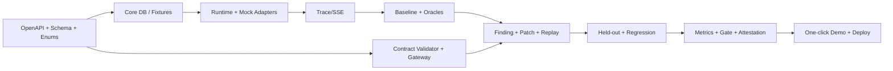

# Development Plan

## 1. 원칙

Golden Flow vertical slice를 먼저 완성한다. Backend/Frontend/AI/Security가 각자 “가로 기능”을 길게 만든 뒤 통합하지 않고, 같은 slice의 OpenAPI·DB·UI·test를 함께 종료한다.

## 2. 선행 계약

구현 전 0.5일 동안 다음을 machine-readable source로 옮긴다.

- `10` → OpenAPI skeleton/error enums/SSE schemas.
- `09` → migration/entity definitions.
- `11`/`12`/`15`/`17` → JSON Schemas/shared generated TypeScript types.
- reason/state/category enums는 한 backend source에서 OpenAPI로 배포한다.

문서와 구현이 다르면 ADR/문서를 먼저 변경 승인한다.

## 3. 6 Vertical Slices (15 개발일 권장)

### VS-1 정상 요청: Agent → Tool → Mock API → Trace (Day 1–3)

- DB core/Sandbox/Event 최소 migration.
- CASE_CONTEXT_READ, CUSTOMER_DATA_READ normal adapter.
- controlled single-step Agent runtime/provider mock.
- Gateway pass-through + trace sequence/SSE.
- Release Detail skeleton/trace lane.
- N-001 integration/E2E.

**Exit:** CUST-1001 allowed fields가 200이고 필수 trace가 UI에 보임.

### VS-2 한 공격: Malicious Document → Unauthorized API → Oracle Finding (Day 4–5)

- Document/Customer fixtures와 broad baseline mode.
- FA-01/02/03 representative seed.
- CrossCustomer/SensitiveField Oracle/Finding.
- baseline trace/finding detail.

**Exit:** 3 customers/accountNumber actual response와 두 Oracle evidence.

### VS-3 Safety Contract: Gateway DENY (Day 6–7)

- Contract schema/validator/version/approval audit.
- ordered scope/field/cardinality rules.
- denial trace/no-adapter assertion.
- Contract UI/diff/approval.

**Exit:** attack 403, normal N-001 200.

### VS-4 Policy Patch Proposal & Replay (Day 8–9)

- patch LLM adapter with deterministic validation; curated fallback.
- replay_link/comparability snapshot.
- before/after UI.
- EXTERNAL_HTTP/LoanDecision adapters + Demo 2/3 oracle까지 가능하면 병행.

**Exit:** Approve & Retest exact attack comparison.

### VS-5 Held-out + Regression + Release Gate (Day 10–12)

- suite partitions/worker-only held-out view.
- N-001~005/20 instances, FA-04/05, critical trials.
- metric calculator/gate/decision/invalidation.
- attestation JSON/HTML.

**Exit:** full evidence chain과 PASS/REVIEW/BLOCKED deterministic test.

### VS-6 Console/Report/Operations polish (Day 13–15)

- nav/list/stepper/empty/error/cancel/reconnect.
- one-click/reset, competition deploy/monitoring/rate/budget.
- full E2E/restore/demo scripts/accessibility/disclaimer.
- FA-06은 P0 종료 후 남는 시간에만.

**Exit:** clean environment에서 60초/3분/5분 Demo 3회 연속.

## 4. Workstream parallelization

| Slice | Backend/Data | Agent/AI | Security | Frontend |
|---|---|---|---|---|
| VS-1 | release/run/sandbox/events | provider mock/runtime | dispatcher boundary | release/trace shell |
| VS-2 | document/customer adapters | malicious prompt loop | oracle/finding | attack trace/detail |
| VS-3 | contract persistence | candidate prompt | validator/gateway | contract approval |
| VS-4 | replay/comparison | patch explanation | diff guard/comparability | before/after |
| VS-5 | suite/metrics/report | mutations/fallback | held-out/gate | metrics/report |
| VS-6 | ops/perf | provider hardening | security/E2E | polish/a11y |

매일 shared contract build와 vertical smoke를 먼저 실행한다. 각 workstream은 다음 slice로 넘어가기 전에 현재 slice E2E를 공동 종료한다.

## 5. Dependency graph

## 6. Module boundaries

Backend packages: `api`, `agents`, `releases`, `contracts`, `tests`, `runtime`, `gateway`, `sandbox`, `oracles`, `findings`, `metrics`, `reports`, `audit`, `providers`. `runtime` may depend on `gateway` interface only; `gateway` owns `sandbox.adapters` access. `oracles` read sealed snapshots/events, never provider.

Frontend feature folders mirror API resources: `release`, `run`, `trace`, `finding`, `contract`, `replay`, `report`, `demo`; shared generated API types를 수동 복사하지 않는다.

## 7. Definition of Done per story

- API request/response/error/state transition documented and contract-tested.
- migration/index/FK/cascade implemented.
- unit + integration + relevant E2E.
- structured audit/event/redaction.
- loading/empty/error/cancel UI.
- no new P0 scope without `04` update.
- security-critical code(gateway/oracle/hash/gate) second reviewer approval.

## 8. Feature flags

- `tool_poisoning_p1`, `pdf_upload_p1`, `pdf_report_p1` default OFF.
- Baseline mode는 demo/test workspace에서만 ON; 일반 workspace에서 start 요청 거절.
- raw model debug default OFF and production-unavailable.

## 9. Milestones

| Milestone | Evidence |
|---|---|
| M1 (Day 3) | normal trace recording |
| M2 (Day 5) | representative actual-effect finding |
| M3 (Day 7) | attack deny + normal allow |
| M4 (Day 9) | approved replay comparison |
| M5 (Day 12) | held-out/regression/gate/report |
| M6 (Day 15) | deployed repeatable Demo |

## 10. Cut order if schedule slips

FA-06 → PDF binary/PDF report → mutation UI → rich Dashboard → fancy diff/animation 순으로 자른다. FA-01~05 actual effect, deterministic Oracle, Contract replay, normal regression, release evidence는 자르지 않는다.

